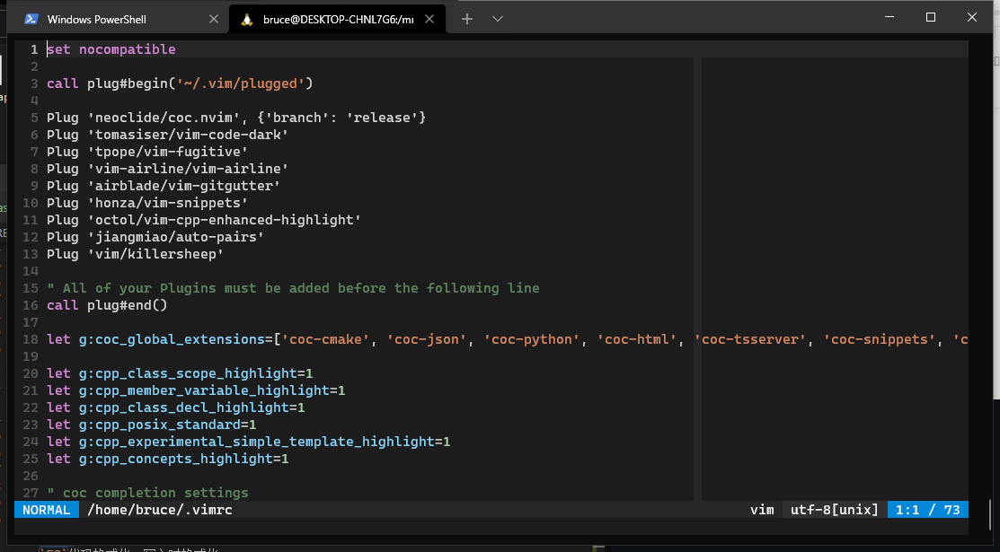

# vimrc

#### 介绍
我的`.vimrc`文件

#### 使用方法
1. 安装最新版`vim`
```
sudo snap install vim
```
2. 下载`Release`中的`vim.tar.gz`并解压到`$HOME`
```
tar -zxvf vim.tar.gz -C $HOME
```
3. 如果你使用`Programmer Dvorak`布局，将`.vimrc`中的第5行取消注释

#### 依赖
```
vim >= 8.2
vim-plug
git
ccls
nodejs
clang-format
python3
```

#### 特性
* 符号配对
* 代码补全
* 块补全
* `Tab`键补全
* `F9`代码格式化，写入时格式化
* 静态检测
* `C++`高亮增强
* `git`分支，新增/删除行检测
* 自定义状态栏
* `VS Code - Dark(Plus)`主题
* `Programmer Dvorak`布局键位优化


